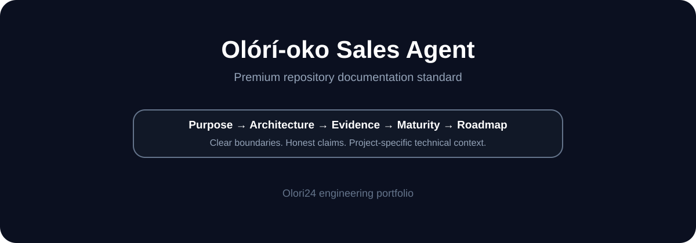

# Olórí-oko Sales Agent

**Sales agent and automation infrastructure.**

> **Repository status:** Active development unless the project-specific status below says otherwise.

## Documentation standard

This repository follows the premium README standard established for NSMS: clear positioning, visual orientation, architecture, security boundaries, setup, validation evidence, maturity tracking and explicit separation between shipped work and roadmap.

| Evidence label | Meaning |
|---|---|
| **IMPLEMENTED** | Present in the repository. |
| **TESTED** | Supported by an executed test or CI result. |
| **DEPLOYED** | A deployment target/configuration exists. |
| **VERIFIED IN PRODUCTION** | Confirmed with production evidence. |
| **MEASURED** | Backed by an actual measurement. |
| **ROADMAP** | Planned work, not shipped capability. |

---

**Engineered under the OAE™ standard — Open Autonomous Engineer**
